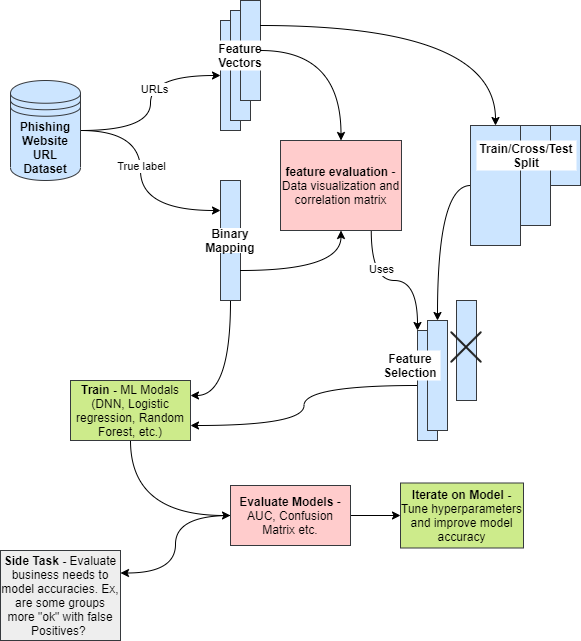
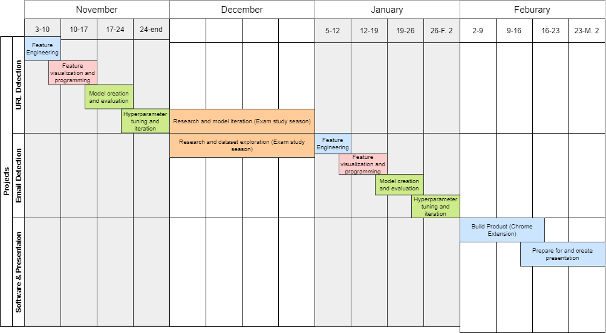

# QMIND - Pishing Email Detection

The project is created under the Queen's University QMIND Club!

"Phishing is the fraudulent attempt to obtain sensitive information or data, such as usernames, passwords and credit card details, by disguising oneself as a trustworthy entity in an electronic communication." [Wikipedia](https://en.wikipedia.org/wiki/Phishing)

The goal of this project is to automatically detect, through the use of Artificial Intelligence, Phishing emails at a high enough accuracy for effective commercial use. It contains three parts:

1. A Machine Learning Model to detect Phishing Websites based on URL information
2. Connecting the resulting URL prediction with a model predicting if the base email is a Phishing scam
3. Combining these components into a Chrome extension application

## Table of Contents

1. [Model and Training Method Overview](#Model-and-Training-Method-Overview)
2. [Roadmap](#Roadmap)

## Model and Training Method Overview

The following model shows the process of feature engineering and model training used for the first classification model of Phishing website based on URL's. This fairly standard flow will also be used for taining the final model to Predict a Phishing Email, however, in this training the dataset must run through the URL Model. This additional step allows this unique feature from the output of the URL Model to be considered in the final model.

Final Model - Predicting a email:

## Roadmap

The following gives a rough timeline for the project, there is a great potential for this timeline to be accelerated.

### Git Commands

#### When you have done work and want to put it onto the website:

git add . (stages the change)
git commit -m "your commit message" (commits the changes to your local repository)
git push (push the changes out to origin - ie the website)

#### To get changes from the website:

git pull (pull the changes from the website to you)
